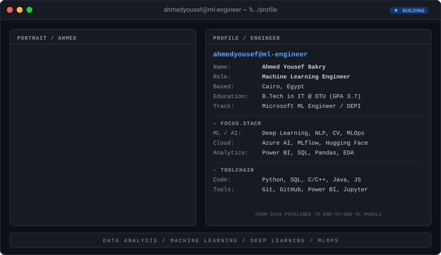

  <!-- Terminal Dashboard SVG Widget -->
  

    

  <!-- Social Badges -->
  
  
  
  
  

---

### 🚀 About Me
Machine Learning Engineer with a solid foundation in Python, statistics, and the end-to-end ML lifecycle (data preprocessing, exploratory analysis, model development, deep learning, and MLOps)[cite: 1]. Building on strong data analytics experience (SQL, Power BI, Advanced Excel), I translate raw data into actionable business insights and scalable machine learning solutions[cite: 1].

---

### 📊 Featured Projects

* **E-Commerce Sales Dashboard** (`Power BI`, `SQL`)
  * Analyzed **99K orders** and **$15.84M** in total revenue across product categories and customer locations[cite: 1].
  * Modeled KPIs including **$160.58 AOV**, **12.09 avg delivery days**, and **97% delivery rate**[cite: 1].

* **Airbnb NYC Listings Analysis & EDA** (`Python`, `Pandas`, `Seaborn`, `Folium`)
  * Performed exploratory data analysis on **~48,000 listings** to identify key price drivers[cite: 1].
  * Applied IQR outlier detection, feature engineering, and log normalization[cite: 1].
  * Created interactive Folium heatmaps visualizing price intensity across NYC boroughs[cite: 1].

* **Smart Traffic & Statistical Analysis** (`Python`, `Pandas`, `Matplotlib`, `Seaborn`)
  * Engineered time/location features from incident data to identify urban traffic accident patterns and peak-risk conditions[cite: 1].

* **Global Video Games Sales Analysis** (`Python`, `Pandas`, `Matplotlib`, `Seaborn`)
  * Preprocessed historical global sales data and analyzed multi-regional trends across platforms, genres, and publishers[cite: 1].

---

### 🎖️ Certifications & Training
* **Microsoft Machine Learning Engineer Track** — AI & Data Science Training[cite: 1]
* **Data Analysis Engineering Diploma** — MEC Academy (2026)[cite: 1]
* **Problem Solving & Python Certifications** — HackerRank[cite: 1]
* **GitHub Foundations** — DataCamp & GitHub (2026)[cite: 1]
