  <!-- Terminal Dashboard SVG Widget (Profile Hero Card - Preserved) -->
  

    

  <!-- Executive Quick Badges -->
  

    
    &nbsp;
    
    &nbsp;
    
    &nbsp;
    
    &nbsp;
    
    &nbsp;
    
  

 

# Hi... I'm Ahmed 

A **Machine Learning Engineer &amp; Data Analyst** turning complex datasets into predictive models, geospatial intelligence, and business-ready solutions based in **Cairo, Egypt**.

- 🔭 Open to project collaborations, internships, and data science challenges
- 💬 Reach out directly via: [LinkedIn](https://www.linkedin.com/in/ahmed-yousef-273050350/) · [Email](mailto:ahmedyousefbakrygouda@gmail.com) · [Kaggle](https://www.kaggle.com/ahmedyousef2003)
- 📄 Direct Resume / CV: [Ahmed_Yousef_Bakry_CV.pdf](./Ahmed_Yousef_Bakry_CV.pdf)

 

<!-- Engineering Overview (Cyberpunk Vector Window) -->

  

 

##  Featured Projects

  
  

 

  
  

 

  
  

  <a href="https://github.com/AhmedYoussefJo?tab=repositories" style="color: #38bdf8; text-decoration: none; font-family: monospace; font-size: 13px; font-weight: bold;">
    <b>[ 📂 EXPLORE ALL PUBLIC REPOSITORIES → ]</b>
  </a>

 

##  Languages &amp; Tools

  

 

##  GitHub Activity

  
  

 

##  Competitive Programming

  

    
    &nbsp;&nbsp;
    
    &nbsp;&nbsp;
    
  

  

    🏆 Contributor, ECPC (Egyptian Collegiate Programming Contest) — 2023 &amp; 2026
  

 

---

  

    📍 <b>Cairo, Egypt</b> &nbsp;•&nbsp; ✉️ <a href="mailto:ahmedyousefbakrygouda@gmail.com" style="color: #38bdf8;">ahmedyousefbakrygouda@gmail.com</a>
  

  <code>ENGINEERED BY <a href="https://www.linkedin.com/in/ahmed-yousef-273050350/">AHMED YOUSEF BAKRY</a> © 2026</code>

