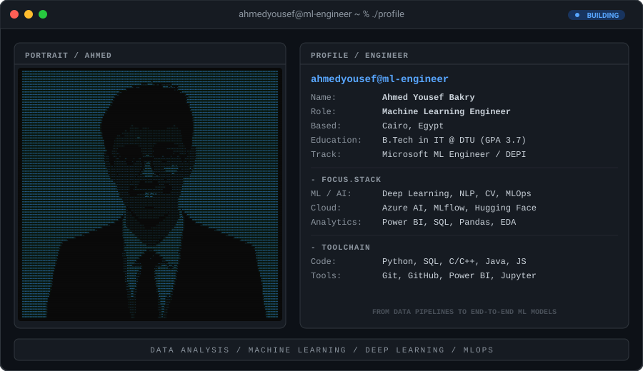

<div align="center">

  <!-- Terminal Dashboard SVG Widget (كارد البداية الخاصة بك) -->
  

  <br/><br/>

 # Ahmed Yousef Bakry

### Machine Learning Engineer · Data Analyst

<p>
  Building data-driven solutions — from raw data and analysis to machine learning workflows.
</p>

<p>
  <a href="https://www.linkedin.com/in/ahmed-yousef-273050350/">
    
  </a>
  <a href="https://www.kaggle.com/ahmedyousef2003">
    
  </a>
  <a href="mailto:ahmedyousefbakrygouda@gmail.com">
    
  </a>
</p>


## About

Machine Learning Engineer with a foundation in **Python, statistics, data analysis, and the end-to-end ML lifecycle**.

Currently pursuing a **B.Tech in Information Technology (Software Track)** at Delta Technological University, with hands-on experience in analytics projects, data collection, preprocessing, visualization, and machine learning training.

`Python` · `SQL` · `Machine Learning` · `Data Analysis` · `Power BI`

---

## ⚡ Tech Arsenal

<!-- Complex HTML Terminal Dashboard for Tech Stack -->
<div align="center">
  <table width="100%" style="background-color: #0d1117; border: 1px solid #30363d; border-radius: 15px; box-shadow: 0 4px 8px rgba(0,0,0,0.5);">
    <!-- Terminal Header -->
    <tr style="background-color: #161b22;">
      <td colspan="4" align="left" style="padding: 10px 15px; border-bottom: 1px solid #30363d; border-top-left-radius: 15px; border-top-right-radius: 15px;">
         <span style="font-size: 16px; margin-right: 15px;">🔴 🟡 🟢</span>
         <code style="color: #20BEFF; background: none; font-size: 13px;">ahmed@workstation ~/tech_arsenal $ ./load_skills.sh</code>
      </td>
    </tr>
    
    <!-- Terminal Body: Complex Nested Grid -->
    <tr>
      <!-- Column 1: AI & ML -->
      <td width="25%" align="center" valign="top" style="padding: 20px 10px; border-right: 1px dashed #30363d;">
         <h4 style="color: #a450ff; font-family: monospace; letter-spacing: 1.5px; margin-bottom: 15px;">[ 🤖 ML & AI ]</h4>
         <br>
         <br>
         <br>
         
      </td>

      <!-- Column 2: Data Analytics -->
      <td width="25%" align="center" valign="top" style="padding: 20px 10px; border-right: 1px dashed #30363d;">
         <h4 style="color: #a450ff; font-family: monospace; letter-spacing: 1.5px; margin-bottom: 15px;">[ 📊 DATA OPS ]</h4>
         <br>
         <br>
         <br>
         
      </td>

      <!-- Column 3: MLOps & Cloud -->
      <td width="25%" align="center" valign="top" style="padding: 20px 10px; border-right: 1px dashed #30363d;">
         <h4 style="color: #a450ff; font-family: monospace; letter-spacing: 1.5px; margin-bottom: 15px;">[ ☁️ CLOUD ]</h4>
         <br>
         <br>
         <br>
         
      </td>

      <!-- Column 4: Core Languages -->
      <td width="25%" align="center" valign="top" style="padding: 20px 10px;">
         <h4 style="color: #a450ff; font-family: monospace; letter-spacing: 1.5px; margin-bottom: 15px;">[ 💻 CORE ]</h4>
         <br>
         <br>
         
      </td>
    </tr>
  </table>
</div>

<br/>

<!-- Dynamic GitHub Analytics Dashboard -->
<div align="center">
  <table width="100%" style="border-collapse: collapse; border: none;">
    <tr>
      <td width="50%" align="center" style="padding-right: 5px; border: none;">
        
      </td>
      <td width="50%" align="center" style="padding-left: 5px; border: none;">
        
      </td>
    </tr>
  </table>
</div>

<br/>

---

## 🚀 Selected Engineering Work

<!-- Dynamic Project Cards (Neon Dark Theme) -->
<div align="center">
  <table width="100%" style="border-collapse: collapse; border: none;">
    <tr>
      <td width="50%" align="center" style="padding: 10px 5px 10px 0; border: none;">
        <a href="https://github.com/AhmedYoussefJo/Australia-Weather-Analytics-EDA">
          
        </a>
      </td>
      <td width="50%" align="center" style="padding: 10px 0 10px 5px; border: none;">
        <a href="https://github.com/AhmedYoussefJo/Global-Video-Games-Sales">
          
        </a>
      </td>
    </tr>
    <tr>
      <td width="50%" align="center" style="padding: 10px 5px 10px 0; border: none;">
        <a href="https://github.com/AhmedYoussefJo/Airbnb-NYC-Listings">
          
        </a>
      </td>
      <td width="50%" align="center" style="padding: 10px 0 10px 5px; border: none;">
        <a href="https://github.com/AhmedYoussefJo/Smart-Traffic-EDA">
          
        </a>
      </td>
    </tr>
  </table>
</div>

---

## 🏗️ Currently Building

```text
→ Machine Learning pipelines
→ Deep Learning applications
→ Computer Vision & NLP
→ MLOps workflows
```
